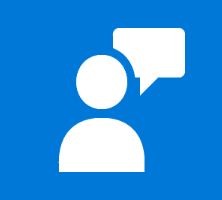

# Standard Phrases When Asking For User Feedback <!-- omit in toc -->

  - [Microsoft Feedback Button](#microsoft-feedback-button)
    - [Feedback Options & Flow](#feedback-options--flow)
  - [Slack - iOS Feedback](#slack---ios-feedback)
  - [Mopinion app feedback](#mopinion-app-feedback)
    - [Customer Satisfaction (CSAT)](#customer-satisfaction-csat)
    - [Goal Completion Rate (GCR)](#goal-completion-rate-gcr)
    - [Customer Effort Score (CES)](#customer-effort-score-ces)
    - [Phrases used by Mopinion](#phrases-used-by-mopinion)

## Microsoft Feedback Button

*Microsoft 365 Apps and Edge all have a Feedback button that provides a quick way for their users to submit a comment or suggestion.* [Microsoft Doc](https://support.microsoft.com/en-us/office/how-do-i-give-feedback-on-microsoft-office-2b102d44-b43f-4dd2-9ff4-23cf144cfb11)  

Microsoft Feedback Button Icon:  
  

Edge's Menu: Hamburger button > Help and Feedback > Send Feedback  
 Help and Feedback > Send Feedback" width="350"/>  

Microsoft 365 Apps (Word, PowerPoint, Excel, OneNote)  
 Feedback Icon > Feedback Options" width="250"/>  

### Feedback Options & Flow

Send feedback to Microsoft
  - 😃 I like something
  - 🙁 I don't like something
  - 🗳️ I have a suggestion

*When an option is clicked, a form opens with the title of the option. Following is the example for `I like something`:*


Top Bar: `Send feedback to Microsoft`  
H1: `I have a suggestion`  
Checkbox: `Include screenshot`  
*When the checkbox is clicked, a screenshot of the app is taken automatically*  
Checkbox: `You can contact me about this feedback`  
*When the checkbox is clicked, the email field is available for input*  
Final Buttons: `Send` or `Cancel`

Details provided below:

```text
By pressing send, your feedback will be used to improve Microsoft
products and services. Your IT admin will be able to collect this data.
Microsoft Services Agreement

Privacy Statement

Customer ID: 00x0x000-xxxx-0x0x-0000-0xx000x00000

Session ID: 000x0xx0-0000-0x00-0xx0-0xx00x0000xx

Audience: Production-Production-CC
```

## Slack - iOS Feedback

Slack iOS App:  
`Preferences` > `Send Feedback` > `What Went Wrong?` Prompt > Default Email App with Email Template

| Preferences                                   | What Went Wrong? Prompt                        | Email Template                                               |
| --------------------------------------------- | ---------------------------------------------- | ------------------------------------------------------------ |
|  |  |  |

## Mopinion app feedback

[5 Easy-To-Use Mobile App Feedback Form Templates - Mopinion](https://mopinion.com/easy-to-use-mobile-app-feedback-form-templates/)

| Type                         | Screenshot                                                                          |
| ---------------------------- | ----------------------------------------------------------------------------------- |
| Customer Satisfaction (CSAT) |  |
| Goal Completion Rate (GCR)   |     |
| Customer Effort Score (CES)  |    |

### Customer Satisfaction (CSAT)
Your opinion is important to us. This way we can keep improving our app.

Your overall satisfaction of the app
*1 to 10 scale*

Please select your feedback category below:
  - Question
  - Suggestion
  - Content
  - Compliment
  - Products
  - Other

Button: Continue

### Goal Completion Rate (GCR)
Did you achieve your goal?
  - Yes
    - *Ask them how much effort it took them to achieve their goal using Customer Effort Score.*
  - Partially
  - No
    - *ask why they are visiting the app*

What was the reason for your visit?
  - Please give your reason

Please describe why you couldn't achieve
your goal
  - `Something went wrong`
  - `Information is missing`
  - `The form doesn’t work well`
  - `Other`

Button: Next

### Customer Effort Score (CES)
`How much effort did it take you to achieve your goal?`
`Do you have any suggestions to improve our app?`
`Please fill in your answer`

### Phrases used by Mopinion

  - `How satisfied are you with this app?`
  - `Did you achieve your goal?`
    - `Yes` , `Partly`, `No`
    - `Something went wrong`
    - `Information is missing`
    - `The form doesn’t work well`
    - `Other`
  - `Do you have any suggestions to make our mobile app better?`
  - `Very little effort`
  - `Do you have any suggestions for improving our mobile app?`
  - `How likely is it that you’ll recommend us to a friend or family member?`
  - `Based on your recent purchase, how likely are you recommend us?`
  - `Why did you provide a score of ___?`
  - `Why are you using this app?`
  - `What did you want to achieve on our app?`
  - `Was this information useful to you?`
  - `Does this information answer your question?`
  - `Is this content clear?`
    - `Yes`, `No`
  - `Can you please explain your answer?`
